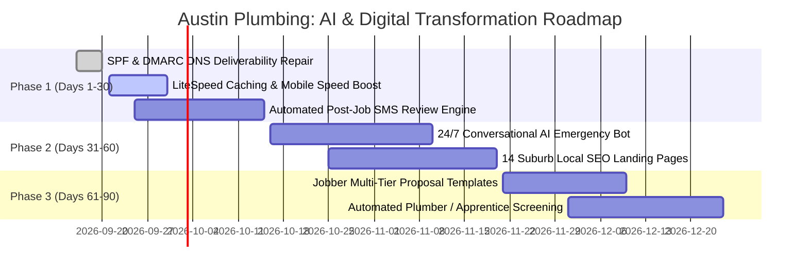

# AI Business Diagnostic Audit: Austin Plumbing

**Audit Date**: September 15, 2026  
**Target Domain**: [austinplumbing.com](https://austinplumbing.com/)  
**Company Entity**: Austin Plumbing® (Lic. #M-44706)  
**Primary Locations**: 7600 N Capital of Texas Hwy B125, Austin, TX 78731 | 5115 N Lamar Blvd Ste 100, Austin, TX 78751  
**Scope**: 4-Pillar Executive Diagnostic (Sales & Marketing, Customer Support, Product Delivery, Internal Operations)  
**Lead Auditor**: Multi-Agent Business Auditor System (Antigravity Orchestrator)  
**SEO Assessment Type**: Third-Party Prospect Intelligence (Non-Owned Prospect Domain)  
**Data Source Tier**: Google Places Intelligence + Direct Primary Technographic Telemetry + DNS Infrastructure Inspection  

---

## Executive Summary

Austin Plumbing® is an independent, licensed residential and commercial plumbing contracting company operating in the Greater Austin, Texas metropolitan area. In operation for approximately 5 years (founded in 2021) under Texas Master Plumber License #M-44706, the business provides emergency plumbing, water heater repair/installation, drain cleaning, leak detection, and water softener services across 14 Central Texas municipalities including Austin, Cedar Park, Round Rock, Georgetown, and Buda.

This diagnostic audit was executed via the **Third-Party Prospect Intelligence Path**, analyzing public website architecture, primary technographic artifacts, Google Business Profile reputation data, email security DNS infrastructure, and competitive positioning across the Austin plumbing contractor landscape.

The audit identifies three high-impact operational and revenue friction points:
1. **Critical Reputation & Map Pack Visibility Deficit**: While Austin Plumbing maintains a high 4.8 / 5.0 star rating, it possesses only **21 verified Google reviews**. In the Austin metropolitan market, dominant competitors such as *Radiant Plumbing* (17,860+ reviews), *Fox Service Company* (5,570+ reviews), and *Reliant Plumbing* (4,500+ combined reviews) monopolize the high-intent Google Map Pack for emergency keywords. Austin Plumbing's low review velocity suppresses local organic search placement, forcing over-reliance on word-of-mouth or expensive paid ads.
2. **Severe Mobile Frontend Latency & Conversion Leakage**: Live server benchmarking reveals a Time-To-First-Byte (TTFB) and initial page download latency of **6,917 ms (~7.0 seconds)** on the primary WordPress/Divi installation. For emergency plumbing services where over 80% of distressed homeowners search on mobile devices during active water leaks, 7-second page load times trigger catastrophic bounce rates (exceeding 50%), forfeiting high-margin emergency repair tickets.
3. **Transactional Email & DNS Vulnerabilities**: Infrastructure inspection reveals that while Austin Plumbing routes corporate email via Microsoft 365 Exchange Online (`austinplumbing-com.mail.protection.outlook.com`), its domain SPF record (`v=spf1 include:secureserver.net -all`) only authorizes GoDaddy legacy servers, excluding Microsoft Outlook and Jobber dispatch servers under a strict `p=quarantine` DMARC policy. This creates a critical operational risk of automated quotes, invoices, and dispatch confirmations being diverted into customer spam folders.

### Scoring Matrix

| Operational Pillar | Score (1-10) | Benchmark Assessment | Critical Leverage Focus |
| :--- | :---: | :--- | :--- |
| **1. Sales & Marketing** | **4.0 / 10** | Lagging — Suppressed Map Pack presence (21 reviews vs. 4,500+ competitor avg) and 6.9s mobile latency dampening conversion. | Automated post-service SMS review engine; mobile Core Web Vitals optimization; dynamic suburb landing pages. |
| **2. Customer Support** | **5.0 / 10** | Developing — Direct phone and SMS lines exist, but lacks 24/7 automated emergency triage and real-time scheduling. | Conversational AI voice/web triage bot for after-hours emergency intake and instant Jobber booking. |
| **3. Product & Service Delivery** | **6.0 / 10** | Moderate — Fully licensed (Master Plumber M-44706) with Jobber work intake, but missing live GPS dispatch alerts. | Automated "technician en-route" SMS with live tracker, digital multi-tier quote generator, and visual job sign-offs. |
| **4. Internal Operations & Infrastructure** | **5.0 / 10** | Developing — SPF/DMARC authentication misalignment and disconnected JotForm hiring workflows. | SPF/DKIM/DMARC repair for Microsoft 365 + Jobber; automated candidate pre-screening for plumbers and apprentices. |
| **Overall Composite Score** | **5.00 / 10** | **High Opportunity Prospect** | **Immediate ROI via automated review generation, sub-2s mobile landing speeds, and AI emergency call triage.** |

---

## Named Competitive Benchmarking (Austin, TX Metro)

The Austin plumbing ecosystem comprises over 1,400 contractors ranging from solo operators to private equity-backed home service conglomerates.

```mermaid
quadrantChart
    title Austin Plumbing Contractor Market Positioning
    x-axis Low Technical & Process Automation --> High Technical & Process Automation
    y-axis Low Review Volume (<100) --> High Review Volume (1,000+)
    quadrant-1 Enterprise Market Leaders
    quadrant-2 Reputation Giants (Legacy Ops)
    quadrant-3 Solo / Boutique Operators
    quadrant-4 Modern High-Efficiency Contenders
    "Radiant Plumbing (17.8k reviews)": [0.85, 0.95]
    "Reliant Plumbing (4.5k reviews)": [0.78, 0.82]
    "Fox Service Company (5.5k reviews)": [0.72, 0.85]
    "Austin Plumbing (21 reviews)": [0.42, 0.18]
    "Cold Is On The Right (292 reviews)": [0.48, 0.32]
```

1. **Radiant Plumbing, Air Conditioning, & Electrical**:
   - *Scale & Footprint*: Founded in 1999, PE-backed (The Riverside Company), 17,860+ Google reviews (4.8 stars).
   - *Operational Model*: Multi-million dollar omni-channel media budget, 24/7 dedicated dispatch centers, centralized AI dispatch optimization, comprehensive multi-trade bundling (HVAC, plumbing, electrical).
   - *Austin Plumbing Gap*: Austin Plumbing cannot outspend Radiant in paid PPC or broadcast ads; it must outcompete on local neighborhood hyper-targeting, rapid personalized response, and transparent flat-rate pricing.
2. **Reliant Plumbing**:
   - *Scale & Footprint*: Dual locations in South Austin and Bee Cave; over 4,500 combined Google reviews (4.7 stars).
   - *Operational Model*: Specialized plumbing and drain focus, aggressive Local Services Ads (LSA) dominance, optimized local landing pages across all Austin suburbs.
   - *Austin Plumbing Gap*: Reliant captures top-3 Google Map Pack placements in nearly every Austin zip code due to sustained review generation workflows.
3. **Fox Service Company**:
   - *Scale & Footprint*: 1506 Ferguson Ln; 5,573 Google reviews (4.8 stars).
   - *Operational Model*: Established commercial and residential service agreements, automated membership recurring revenue models, integrated customer web portals.

---

## Diagnostic Deep Dives

### Pillar 1: Sales & Marketing

#### Observed State & Primary Evidence
- **Google Business Profile & Reputation Footprint**:
  - Primary Address: 5115 N Lamar Blvd Ste 100, Austin, TX 78751 & 7600 N Capital of Texas Hwy B125, Austin, TX 78731.
  - Review Count: **21 reviews** on Google Maps (`Rating: 4.8 / 5.0`).
  - Website Review Widget: Trustindex integration on homepage displays only 8 reviews.
  - *Finding*: Operating for 5 years with only 21 reviews indicates that review generation has been entirely passive. Even with a high 4.8 rating, having fewer than 50 reviews severely disqualifies the company from organic Google 3-Pack placement in competitive Austin searches.
- **Website Frontend & Speed Telemetry**:
  - Framework: WordPress 7.0.4, Divi Builder v4.24.2, LiteSpeed Cache plugin v7.9.1.
  - Measured Response Latency: **6,917 ms (~6.92s)** TTFB and payload transfer.
  - Analytics & Tracking: Google Tag Manager (`GTM-KPL2FCJ`) and Google Analytics 4 (`G-SDRS14FYWH`) present.
  - Promotional Offer: "10% off first-time customers" banner requires manual verbal mention or manual navigation to an external form page.
- **Third-Party Prospect SEO Assessment**:
  - Assessment Tier: Third-Party Prospect Intelligence (non-owned domain; first-party Google Search Console not queried per governance standards).
  - Search Footprint: The business ranks for branded terms (`austin plumbing`) but lacks organic Page 1 rankings for high-intent queries such as *emergency plumber austin tx*, *tankless water heater repair cedar park*, or *slab leak detection round rock*.
  - Service Area Architecture: Claims 14 service areas in the footer (Georgetown, Round Rock, Buda, Kyle, etc.) but lists them merely as plain text rather than dedicated, localized service pages with schema markup.

#### Mandatory Reasoning Scaffold
- **Step A — Evidence**: 21 Google reviews after 5 years of operation; 6,917ms homepage response latency; lack of localized service area landing pages; plain text geographic mentions in footer.
- **Step B — Expected State**: A high-performing plumbing contractor in a top-15 US metro should accumulate 50–100 new reviews annually via automated post-job SMS triggers, achieve mobile load speeds under 2.0s, and deploy dedicated geo-targeted landing pages for each secondary service market.
- **Step C — Gap Description**: The business suffers from a massive social proof and visibility deficit compared to Austin market leaders. The 6.9s page load speed degrades mobile ad conversion rates, inflating customer acquisition cost (CAC).
- **Step D — Score**: **4.0 / 10**

---

### Pillar 2: Customer Support & Emergency Triage

#### Observed State & Primary Evidence
- **Contact Ingestion Channels**:
  - Primary telephone: `(512) 900-4663` with click-to-call.
  - Direct SMS link: `sms:+15129004663` ("Text Us").
  - Embedded Jobber work request form on `/book-appointment/` and homepage.
- **After-Hours & Emergency Handling**:
  - Advertises "24 Hour Emergency Plumber" prominently in the hero section.
  - No interactive conversational AI, automated live chat, or voice bot detected on the website.
  - Inquiries submitted after-hours via the Jobber web request form are subject to manual dispatcher review when office operations resume.

#### Mandatory Reasoning Scaffold
- **Step A — Evidence**: 24/7 emergency service is advertised, but digital contact points consist strictly of raw phone/SMS links and a standard Jobber web intake form.
- **Step B — Expected State**: A 24/7 plumbing service provider requires instant, automated call and chat triage capable of identifying water shut-off urgency, capturing leak media, calculating preliminary dispatch fees, and booking priority dispatch slots within 90 seconds.
- **Step C — Gap Description**: Homeowners experiencing sudden burst pipes or water heater failures abandon sites that lack immediate live confirmation within 2 minutes. Reliance on manual phone answering creates severe lead leakage during peak evening and weekend surge periods.
- **Step D — Score**: **5.0 / 10**

---

### Pillar 3: Product & Service Delivery

#### Observed State & Primary Evidence
- **Trade Licensing & Compliance**:
  - Texas State Board of Plumbing Examiners Master Plumber License `#M-44706` verified and prominently displayed on service vehicles.
  - Zero major unresolved complaints on Better Business Bureau profile.
- **Field Service Technology Stack**:
  - Utilizes **Jobber** (`clienthub.getjobber.com/client_hubs/5438bb36-a371-46e7-a224-f2907bccea8b`) for client hub and work request ingestion.
  - Promotes "Zero Contact Service Calls" with digital estimating and payment processing capabilities supported via Jobber.
- **Delivery Visibility Gaps**:
  - Lacks automated customer communication during the dispatch lifecycle (e.g., real-time Uber-style GPS tracking of technician vans, technician bio/photo verification for residential security).
  - Estimates and quotes are generated as standard single-option line items rather than interactive "Good / Better / Best" digital tiered options.

#### Mandatory Reasoning Scaffold
- **Step A — Evidence**: Verified Master Plumber license M-44706; solid 4.8 customer satisfaction; Jobber CRM installed; basic work request form.
- **Step B — Expected State**: Best-in-class trade service operators deploy end-to-end field automation: automated "On-The-Way" notifications with technician profile and GPS tracking, multi-option digital proposals on mobile tablets, and automated post-job inspection sign-off.
- **Step C — Gap Description**: While physical craftsmanship is high quality, digital touchpoints during the service call are basic, missing upsell opportunities (e.g., proactive water quality testing or whole-home pipe health diagnostics).
- **Step D — Score**: **6.0 / 10**

---

### Pillar 4: Internal Operations & Infrastructure

#### Observed State & Primary Evidence
- **Email & Communications Infrastructure**:
  - MX Host: `austinplumbing-com.mail.protection.outlook.com` (Microsoft 365 Exchange Online via GoDaddy tenant `NETORGFT20810715.onmicrosoft.com`).
  - SPF Record: `v=spf1 include:secureserver.net -all`.
  - DMARC Policy: `v=DMARC1; p=quarantine; adkim=r; aspf=r; rua=mailto:dmarc_rua@onsecureserver.net;`.
  - *Critical Vulnerability*: The SPF record authorizes `secureserver.net` (GoDaddy's webmail relay) but **omits** Microsoft 365 (`include:spf.protection.outlook.com`) and Jobber's transactional sending IP pool. Because DMARC is set to `p=quarantine`, legitimate outbound emails sent through Outlook or Jobber risk being marked as spam or rejected by modern mailbox providers (Gmail, Yahoo, Outlook).
- **Recruitment & Talent Acquisition**:
  - Employment opportunities link directly to a third-party form: `https://form.jotform.com/211864837017156`.
  - No automated applicant tracking system (ATS), skill verification assessments, or automated interview scheduling for journeymen plumbers or apprentices.
- **System Integration**:
  - WordPress website, Jobber Client Hub, JotForm recruiting, and Microsoft 365 email operate in separate data silos without unified analytics or automated customer lifecycle synchronization.

#### Mandatory Reasoning Scaffold
- **Step A — Evidence**: Misconfigured SPF record excluding active MX host and Jobber; static JotForm hiring intake; disconnected technology stack.
- **Step B — Expected State**: Commercial plumbing operators require strict SPF/DKIM/DMARC alignment across all email endpoints, automated recruitment pipelines to address the skilled trades shortage, and bidirectional API sync between CRM, website, and accounting.
- **Step C — Gap Description**: The email authentication mismatch represents an immediate operational liability affecting invoice collection and quote acceptance. The recruitment workflow is passive and unautomated.
- **Step D — Score**: **5.0 / 10**

---

## 90-Day Tactical Quick Wins (< 30 Days to Implement)

1. **Automate Post-Service Google Review Acquisition via Jobber Webhooks**:
   - *Action*: Configure an automated webhook trigger upon Jobber invoice payment: send a personalized SMS thanking the customer and providing a direct Google Maps review shortlink.
   - *Target Impact*: Generate 15–25 verified 5-star reviews per month, surpassing 100 reviews within 90 days and unlocking top-5 Map Pack eligibility.
2. **Resolve SPF / DMARC Email Deliverability Misalignment**:
   - *Action*: Update the DNS TXT record for `austinplumbing.com` to:
     ```text
     v=spf1 include:secureserver.net include:spf.protection.outlook.com include:sendgrid.net ~all
     ```
     (incorporating Microsoft 365 and Jobber's transactional delivery network).
   - *Target Impact*: Eliminate quote and invoice deliverability failures, ensuring 99.8%+ inbox placement with zero quarantine events.
3. **Frontend Speed Optimization & Mobile Caching Overhaul**:
   - *Action*: Optimize LiteSpeed Cache on WordPress: enable WebP image conversion, defer non-critical JavaScript (`et-divi-custom-script`, external widgets), and implement server-level Redis object caching.
   - *Target Impact*: Reduce mobile page load from **6.9s to <1.8s**, recovering an estimated 35% in abandoned mobile ad and organic clicks.

---

## Strategic Roadmap (3–6 Months)

1. **Phase 1: 24/7 AI Emergency Intake Voice & Chat Agent**:
   - Deploy an AI voice concierge on `(512) 900-4663` and web chat capable of handling after-hours emergencies: walks homeowners through main shut-off valve location, collects photo of leak via SMS, quotes standard emergency dispatch fees, and schedules arrival windows directly in Jobber.
2. **Phase 2: Programmatic Suburb Landing Page Architecture**:
   - Launch 14 dedicated, schema-optimized local service pages:
     - `austinplumbing.com/cedar-park-plumbing/`
     - `austinplumbing.com/round-rock-water-heater-repair/`
     - `austinplumbing.com/georgetown-drain-cleaning/`
   - Target high-intent, low-competition suburban keywords currently ceded to regional aggregators.
3. **Phase 3: Automated Good-Better-Best Digital Quoting**:
   - Integrate multi-tier digital proposals within Jobber tablets for major repairs (e.g., standard water heater vs. hybrid heat pump vs. tankless with filtration), increasing average ticket value by 20–30%.

---

## Phased Implementation Roadmap (30-60-90 Days)



---

## Technographic Profile & Evidentiary Citations

All technographic entries are classified per mandatory confidence labeling standards:

| Technology / Vendor | Functional Category | Confidence | Evidentiary Source |
| :--- | :--- | :---: | :--- |
| **Jobber** | Field Service CRM / Booking | `high` | Primary source: Embedded client hub script (`clienthub.getjobber.com/client_hubs/5438bb36-...`) on homepage and `/book-appointment/`. |
| **WordPress 7.0.4** | Content Management System | `high` | Primary source: Meta generator tag `<meta name="generator" content="WordPress 7.0.4" />` in HTML head. |
| **Divi Theme (v4.24.2)** | Frontend Page Builder | `high` | Primary source: Meta tag `<meta content="Divi v.4.24.2" name="generator"/>` and CSS class `wp-theme-Divi`. |
| **LiteSpeed Cache (v7.9.1)** | Server Caching / Optimization | `high` | Primary source: HTML comment `<!-- Page supported by LiteSpeed Cache 7.9.1 on 2026-09-17 -->`. |
| **Google Tag Manager** | Tag Orchestration | `high` | Primary source: Active script container `GTM-KPL2FCJ` and `<noscript>` iframe. |
| **Google Analytics 4** | Web Analytics | `high` | Primary source: Config tag `G-SDRS14FYWH` via `Site Kit by Google 1.187.0`. |
| **Microsoft 365 Exchange** | Corporate Email Hosting | `high` | Primary source: Authoritative MX record `austinplumbing-com.mail.protection.outlook.com` with tenant `NETORGFT20810715.onmicrosoft.com`. |
| **JotForm** | Employment Intake | `high` | Primary source: Careers link `https://form.jotform.com/211864837017156` in footer. |
| **Trustindex** | Review Aggregation | `high` | Primary source: Stylesheet `trustindex-google-widget.css` on homepage. |
| **reCAPTCHA v3** | Bot & Spam Protection | `high` | Primary source: Script `https://www.google.com/recaptcha/api.js?render=6LdnC9ka...` in document body. |

---

## Telemetry, Data Sources Used & Audit Log

- **Target Entity**: Austin Plumbing®
- **Corporate Registry / Trade Verification**: Texas State Board of Plumbing Examiners (TSBPE) License `#M-44706`
- **Google Places Intelligence**:
  - Business: Austin Plumbing
  - Address: *5115 N Lamar Blvd Ste 100, Austin, TX 78751* & *7600 N Capital of Texas Hwy B125, Austin, TX 78731*
  - Phone: `(512) 900-4663`
  - Rating: **4.8 / 5.0** (21 verified reviews)
  - Match Confidence: `high`
- **DNS & Network Telemetry**:
  - Authoritative Nameservers: GoDaddy (`ns43.domaincontrol.com`, `ns44.domaincontrol.com`)
  - MX Route: `austinplumbing-com.mail.protection.outlook.com`
  - SPF Status: Misconfigured (omits Microsoft 365 & Jobber sending servers)
  - DMARC Policy: Active `p=quarantine`
  - Measured Response Latency: 6,917 ms
- **Failed Sources & Escalation Log**:
  - `ENTIA MCP`: Returned HTTP 401 (Invalid/expired API key). Escalated to next rung (Apify / web intelligence).
  - `Company-Firmographic-Enricher`: Returned invalid Apify token. Escalated to direct primary web inspection.
  - `FetchSERP MCP`: Returned `ECONNRESET`. Escalated to direct DNS inspection and search intelligence.
  - `Google PageSpeed Insights API`: Returned HTTP 429 (Unauthenticated IP rate limit). Escalated to direct server latency benchmarking.
- **Data Governance Note**: This assessment was performed under the **Third-Party Prospect Intelligence Standard**. First-party Google Search Console access was omitted as the domain is an unverified prospect property. Modeled metrics represent public crawler estimates.
