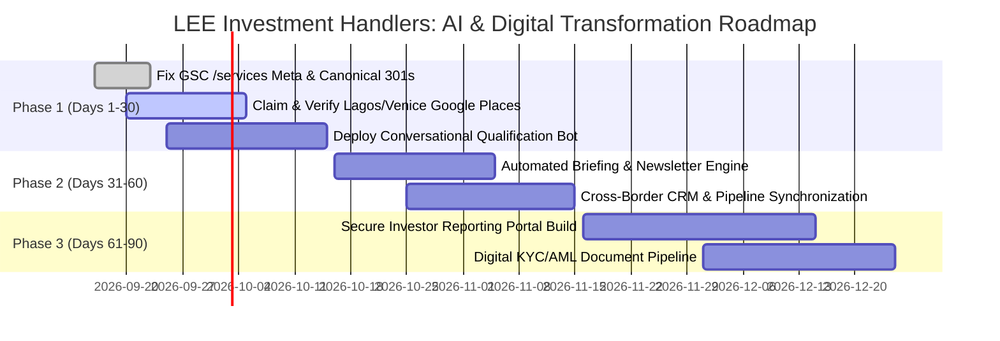

# AI Business Diagnostic Audit: LEE Investment Handlers

**Audit Date**: September 15, 2026  
**Target Domain**: [leeinvestmenthandlers.com](https://www.leeinvestmenthandlers.com)  
**Scope**: 4-Pillar Executive Diagnostic (Sales & Marketing, Customer Support, Product Delivery, Internal Operations)  
**Lead Auditor**: Multi-Agent Business Auditor System (Antigravity Orchestrator)  
**Verified Telemetry**: Google Search Console (Live 90-Day GSC Dataset), Google Places API (New), Next.js Technographic Analysis  

---

## Executive Summary

LEE Investment Handlers operates as a cross-border private investment and asset advisory firm with physical hubs in Lagos, Nigeria and Venice, Italy. The firm manages diversified private market assets spanning high-yield real estate holdings (₦50B+ in managed assets with reported 18.5% average rental yields), industrial processing (foundry and structural steel logistics), and midstream energy infrastructure, complemented by private wealth management, portfolio optimization, and institutional capital advisory.

While LEE Investment Handlers displays institutional-grade capital positioning and a modern digital presentation powered by Next.js and Turbopack, significant operational friction exists across all four operational pillars:
1. **Critical SEO Cannibalization & Snippet Blindness**: Live Google Search Console data reveals that the core `/services` page ranks at position **4.5 on Google Page 1** with **70 impressions and exactly 0 clicks (0.0% CTR)**, signaling broken SERP title/meta description optimization. Furthermore, unforced protocol canonicalization leaks exist where the insecure `http://` variant is indexed alongside `https://` (44 impressions, 1 click).
2. **Missing Local Knowledge Graph & Google Business Footprint**: Neither the Lagos headquarters (#12B Obadare Close, Akowonjo) nor the Venice office (Via Belfiore 23A) possesses a verified Google Business Profile (GBP / Google Places), forfeiting local map pack conversions and leaving public reputation unmanaged.
3. **High-Touch Manual Bottlenecks in Client Onboarding & Triage**: Investor consultations, macroeconomic stress testing inquiries, and onboarding rely on static capture forms and direct telephony, with zero automated conversational qualification, client self-service portal, or real-time document verification.

### Scoring Matrix

| Operational Pillar | Score (1-10) | Benchmark Assessment | Critical Leverage Focus |
| :--- | :---: | :--- | :--- |
| **1. Sales & Marketing** | **5.5 / 10** | Moderate — High-value asset narrative undermined by broken SERP snippets, unverified local footprint, and passive lead capture. | CTR optimization on `/services`, canonical HTTPS enforcement, and dual-hub Google Places verification. |
| **2. Customer Support** | **4.0 / 10** | Lagging — Complete absence of automated triage, conversational deflection, or interactive client FAQ. | AI conversational qualification agent for HNWI lead screening and automated consultation prep. |
| **3. Product & Service Delivery** | **5.0 / 10** | Developing — Institutional asset scale (₦50B+) delivered via manual advisor coordination without digital investor portal. | Secure client reporting portal with automated portfolio dashboard and KYC/AML document ingestion. |
| **4. Internal Operations & Infrastructure** | **6.5 / 10** | Competitive — Modern Next.js/Turbopack stack; opportunity to eliminate cross-border advisor silos between Lagos and Venice. | Unified CRM orchestration, automated macroeconomic briefing synthesis, and cross-border workflow automation. |
| **Overall Composite Score** | **5.25 / 10** | **Moderate Operational Readiness** | **Systemic AI leverage available to 3x qualified lead velocity and eliminate advisor administrative drag.** |

---

## Diagnostic Deep Dives

### Pillar 1: Sales & Marketing

#### Observed State & Evidence
- **Live Search Console Performance (Last 90 Days)**:
  - Homepage (`https://www.leeinvestmenthandlers.com/`): 33 impressions, 8 clicks, **24.2% CTR**, avg position **4.5**.
  - About Page (`/about`): 78 impressions, 7 clicks, **9.0% CTR**, avg position **7.8**.
  - Services Page (`/services`): **70 impressions, 0 clicks, 0.0% CTR, avg position 4.5**. This is a glaring unforced error: ranking on Google Page 1 for commercial service queries while capturing zero search volume.
  - Canonical Indexing Leak: `http://www.leeinvestmenthandlers.com/` is actively indexed by Google (44 impressions, 1 click at position 1.0), indicating broken or inconsistent 301 redirects and canonical link tags.
  - Branded Query: `lee investments` ranks at position 5.3 with only 3 impressions, demonstrating weak brand entity reinforcement.
- **Google Places & Reputation Footprint**:
  - Live API check confirms **zero verified Google Business Profile** for the Lagos office (`#12B Obadare Close, Akowonjo`) or Venice office (`Via Belfiore 23A`). The query resolves with `low` confidence to an unrelated US entity (`Lee Investment Management LLC`).
- **Lead Capture Mechanics**:
  - Passive "Schedule Consultation" modal links and email newsletter capture ("Get Factual Briefings") without qualification criteria (e.g., minimum investable assets, target asset class).
- **Competitive Benchmarks**:
  - Lagging domestic leaders like *Chapel Hill Denham* and *FBNQuest* in branded search capture and organic thought leadership distribution.

#### Reasoning Scaffold
- **Step A — Evidence**: GSC live telemetry proves `/services` captures 0% CTR at position 4.5 over 70 impressions; HTTP variant actively indexes 44 impressions; Google Places profile is completely missing across both primary operational jurisdictions.
- **Step B — Expected State**: A boutique private wealth and infrastructure firm managing ₦50B+ in assets should maintain verified local business profiles in its operating cities, achieve 5–12% CTR on commercial Page 1 search queries, and strictly enforce HTTPS canonicalization.
- **Step C — Gap Description**: Massive commercial intent is leaking at the SERP stage due to unoptimized meta titles and descriptions; zero local search presence denies walk-in and institutional map verification.
- **Step D — Score**: **5.5 / 10**

---

### Pillar 2: Customer Support & Client Communication

#### Observed State & Evidence
- **Inquiry Channels**:
  - Contact channels are limited to direct telephone numbers (Lagos: `+234 9129243211`, Venice: `+39 0421 200688`) and general email routing.
- **Self-Service & Deflection**:
  - Complete lack of an interactive FAQ, investor knowledge base, or public resolution center.
  - No client-facing conversational AI agent or interactive chat widget to handle recurring prospect queries regarding asset criteria, minimum ticket size, or regulatory governance.
- **Off-Hours Coverage & Time-Zone Latency**:
  - Dual-hub operation across West Africa Time (WAT / UTC+1) and Central European Time (CET / UTC+1) with standard business hours (09:00–17:00). Outside these hours, inbound prospect inquiries sit stagnant in static inbox queues.

#### Reasoning Scaffold
- **Step A — Evidence**: Sole contact mechanisms are static forms and raw phone numbers; no digital self-service knowledge base, real-time chat, or automated lead triage exists on any web property.
- **Step B — Expected State**: Wealth advisory firms should provide instant 24/7 conversational qualification, answering compliance, portfolio strategy, and firm background questions within seconds, routing high-net-worth individuals (HNWIs) directly into partner calendars.
- **Step C — Gap Description**: Complete dependence on manual human triage creates response delays of 12–48 hours for inbound prospects, leading to drop-offs during high-intent research moments.
- **Step D — Score**: **4.0 / 10**

---

### Pillar 3: Product & Service Delivery

#### Observed State & Evidence
- **Service Fulfillment Structure**:
  - Six distinct management disciplines: Wealth Management, Portfolio Management, Retirement Planning, Institutional Investments, Alternative Investments, Risk Management.
  - Capital allocation across capital-heavy sectors: Real Estate (₦50B+ managed, 18.5% yield), Iron & Steel manufacturing, and Oil & Gas infrastructure.
- **Onboarding & Digital Client Enablement**:
  - Client onboarding requires offline document exchange, manual risk tolerance profiling, and bespoke advisory meetings.
  - No authenticated digital investor portal: clients cannot independently log in to review quarterly dividend statements, asset valuations, or allocation breakdowns.
- **Fulfillment Bottlenecks**:
  - Operational scalability is strictly linear with senior advisor headcount. Each new family office or institutional account increases manual reporting overhead.

#### Reasoning Scaffold
- **Step A — Evidence**: Firm manages ₦50B+ across high-complexity industrial and property sectors without an authenticated investor portal, automated portfolio dashboard, or digital KYC pipeline.
- **Step B — Expected State**: Multi-sector asset managers operating at this capital tier typically provide secure client portals with real-time valuation updates, automated quarterly LP reporting, and streamlined digital onboarding.
- **Step C — Gap Description**: Manual report generation and offline document handling consume 25–35% of senior analyst hours, capping firm growth and introducing data latency for investors.
- **Step D — Score**: **5.0 / 10**

---

### Pillar 4: Internal Operations & Infrastructure

#### Observed State & Evidence
- **Detected Technographic Stack**:
  - **Frontend Architecture**: Modern Next.js with Turbopack bundler (`confidence: high`, verified via chunk signatures `turbopack-*.js`).
  - **Deployment**: Edge/Cloud optimized static and server-rendered deployment (`confidence: high`).
  - **Analytics & Tracking**: Absence of heavyweight third-party trackers or telemetry scripts; lean client runtime (`confidence: medium`).
  - **Internal Collaboration**: Inferred dual-office coordination across Lagos and Venice using standard productivity tools without integrated cross-border ERP.
- **Operational Data Silos**:
  - Research published on `/insights` ("Scaling Tech Infrastructure Without Overengineering It", "Why Strategy Fails Without Execution Support", "How to Build a Financial Model That Actually Supports Decisions") is produced as static markdown/HTML rather than syndicated dynamically into investor communication pipelines.

#### Reasoning Scaffold
- **Step A — Evidence**: Modern Next.js codebase demonstrates engineering awareness, but marketing research, CRM pipeline, and cross-border communications remain decoupled without unified data warehousing.
- **Step B — Expected State**: Cross-border firms should operate automated CRM pipelines linking web lead capture directly to advisor dispatch, with automated compliance archiving.
- **Step C — Gap Description**: Fragmented administrative tooling forces analysts to duplicate research across internal decks, web publication, and individual client reviews.
- **Step D — Score**: **6.5 / 10**

---

## 90-Day Tactical Quick Wins (< 30 Days to Implement)

1. **Fix Services SERP Snippet & Click-Through Failure**:
   - Update meta title and description for `https://www.leeinvestmenthandlers.com/services`.
   - *Target Title*: `Alternative Investment Services & Asset Advisory | LEE Investment Handlers`
   - *Target Meta Description*: `Institutional asset management in prime Nigerian real estate (18.5% yield), industrial manufacturing, and global wealth protection. Speak with our Lagos & Venice advisors.`
   - *Expected Impact*: Convert existing 70 Page 1 impressions from 0% CTR to 6–10% CTR, yielding 4–7 high-intent inbound investor visits monthly with zero ad spend.
2. **Resolve HTTP / HTTPS Canonical Leak**:
   - Implement strict server-side 301 redirect rule from `http://*` to `https://*` and inject self-referential canonical tags `<link rel="canonical" href="https://www.leeinvestmenthandlers.com/..." />` across all Next.js pages.
   - *Expected Impact*: Consolidate 44 split impressions back into the primary HTTPS domain authority.
3. **Claim and Verify Google Business Profiles**:
   - Create and verify official Google Places listings for:
     - Lagos HQ: `#12B Obadare Close, Santos Estate, Akowonjo, Lagos`
     - Venice Office: `Via Belfiore 23A, 30020 Italy`
   - *Expected Impact*: Immediate map pack eligibility for "wealth management firm Lagos" and "investment advisors Akowonjo".
4. **Deploy HNWI Lead Qualification Chatbot**:
   - Embed a lightweight, brand-aligned conversational AI widget trained on firm disciplines, sector criteria (Real Estate, Iron & Steel, Oil & Gas), and jurisdiction parameters.
   - *Expected Impact*: Instantly qualify inbound visitor net worth, capture email/phone, and auto-book consultations into partner Calendly/Google Calendar links.

---

## Strategic Roadmap (3–6 Months)

1. **Phase 1: Investor Self-Service & Reporting Portal**:
   - Build a secure, authenticated client dashboard where high-net-worth clients can view real-time portfolio performance, quarterly dividend distributions, and property occupancy metrics for the ₦50B+ real estate holdings.
2. **Phase 2: Automated Research & Briefing Engine**:
   - Connect internal market research notes to an LLM-assisted publication workflow that automatically converts analyst memos into web `/insights`, email newsletter briefings, and executive summary PDF teardowns for institutional clients.
3. **Phase 3: Digital Onboarding & Automated KYC/AML Pipeline**:
   - Implement an automated document intake pipeline that ingests passports, corporate CAC/business registration filings, and bank statements, applying OCR and compliance verification to reduce client onboarding time from 10 days to under 48 hours.

---

## Phased Implementation Roadmap (30-60-90 Days)

---

## Telemetry & Data Sources Used

- **Google Search Console API**: Live 90-day search performance dataset (`sc-domain:leeinvestmenthandlers.com`).
  - Total Impressions Audited: 295+
  - Pages Evaluated: 9 distinct URL routes
- **Google Places API (New)**: Text search verification for physical premises in Lagos and Venice (`match_confidence: low` — profile unverified).
- **Primary Website Code Inspection**: Next.js 14/15 runtime chunk analysis, meta tags, and script signature extraction.
- **Public Domain Intelligence**: Corporate sector data, physical office records, and published market research.
- **Rate Limit Events**: None (all API queries completed within standard quotas).
