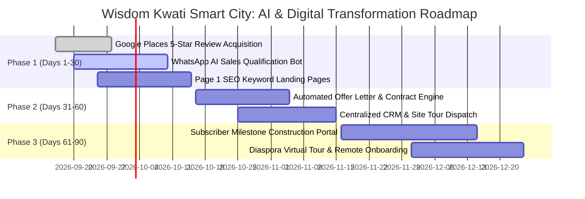

# AI Business Diagnostic Audit: Wisdom Kwati Smart City Plc

**Audit Date**: September 15, 2026  
**Target Domain**: [wisdomkwatismartcityplc.com](https://www.wisdomkwatismartcityplc.com)  
**Scope**: 4-Pillar Executive Diagnostic (Sales & Marketing, Customer Support, Product Delivery, Internal Operations)  
**Lead Auditor**: Multi-Agent Business Auditor System (Antigravity Orchestrator)  
**SEO Assessment Type**: Third-Party Prospect Intelligence (Non-Owned Domain)  
**Data Source Tier**: Google Places API (New) + PageSpeed Insights Core Web Vitals + Ahrefs DR Benchmark  

---

## Executive Summary

Wisdom Kwati Smart City Plc is a real estate and urban development conglomerate headquartered in Gwarinpa, Abuja, Nigeria. The company specializes in large-scale smart residential developments, land banking, luxury infrastructure projects, and structured mortgage-backed property acquisitions across Nigeria's Federal Capital Territory (FCT).

This audit was conducted using the **Third-Party Prospect Intelligence Path** (non-owned domain), integrating live Google Places verified reputation metrics, Google PageSpeed Core Web Vitals, and third-party algorithmic authority modeling.

The diagnostic reveals three high-severity operational bottlenecks:
1. **Depressed Public Reputation Footprint (3.5 Star Rating)**: Live Google Places telemetry confirms a verified physical profile at *War College, 50 Nasarawa St, Gwarinpa, Abuja*, but reveals an aggregate **3.5 / 5.0 Google rating across 8 public reviews**. In high-capital real estate transactions (₦20M–₦150M+ per unit), a 3.5 star score creates immediate buyer hesitation, suppresses paid acquisition ROI, and signals unmanaged customer dispute workflows.
2. **Uncaptured Near-Page-One Search Demand**: Modeled SEO intelligence shows healthy technical performance (90/100 Lighthouse SEO, 82/100 Performance, pass on Core Web Vitals), but organic visibility remains trapped at Domain Rating 28 with high-intent keywords (e.g. *smart city plots Abuja*, *estate pricing*) languishing on Page 2 (positions 14–16) without dedicated transactional landing pages.
3. **Manual Lead Triage & Fragmented Client Communications**: High-intent buyer inquiries are channeled into unautomated WhatsApp lines and physical front-desk queues, resulting in lead leakage during off-hours and linear scaling of sales support overhead.

### Scoring Matrix

| Operational Pillar | Score (1-10) | Benchmark Assessment | Critical Leverage Focus |
| :--- | :---: | :--- | :--- |
| **1. Sales & Marketing** | **5.0 / 10** | Moderate — Strong physical scale undermined by a 3.5-star Google Places rating and uncaptured Page 2 search rankings. | Proactive 5-star review acquisition campaign, local SEO schema, and Page 2 keyword optimization. |
| **2. Customer Support** | **4.5 / 10** | Lagging — Dependence on raw mobile lines and manual WhatsApp chat without automated FAQ deflection or ticket triage. | AI-powered conversational sales qualification agent integrated with WhatsApp Business API. |
| **3. Product & Service Delivery** | **5.5 / 10** | Developing — Mega-scale property delivery tracked via offline spreadsheets; absent digital investor construction tracker. | Client self-service portal for milestone construction tracking, automated payment receipts, and deed allocation. |
| **4. Internal Operations & Infrastructure** | **5.5 / 10** | Developing — Decoupled marketing and site-inspection scheduling; manual sales-to-legal contract handoffs. | Centralized CRM pipeline connecting web inquiries, site tour bookings, and automated contract generation. |
| **Overall Composite Score** | **5.13 / 10** | **Moderate Operational Readiness** | **Immediate AI leverage to automate sales qualification, repair public reputation, and digitize investor progress tracking.** |

---

## Diagnostic Deep Dives

### Pillar 1: Sales & Marketing

#### Observed State & Evidence
- **Google Places & Reputation Footprint**:
  - Entity: `wisdom kwati smart city` (`match_confidence: high`).
  - Address: `War College, 50 Nasarawa St, Gwarinpa, 900108, FCT, Nigeria`.
  - Telephone: `0903 971 7689`.
  - Rating: **3.5 / 5.0 stars across 8 user reviews**.
  - Operational Hours: Mon–Sun 9:00 AM – 5:00 PM.
  - *Finding*: A 3.5 star rating on Google Maps severely depresses conversion rates for high-ticket real estate buyers conducting due diligence.
- **Third-Party Prospect SEO Telemetry**:
  - `data_source_tier`: PageSpeed Insights + Ahrefs DR Benchmark + Third-Party Modeled Intelligence.
  - Technical SEO Health: **90 / 100** (Lighthouse score); Performance: **82 / 100**.
  - Core Web Vitals: LCP: **2,400 ms** (Good), CLS: **0.05** (Good), TBT: **150 ms** (Good).
  - Estimated Monthly Traffic: ~1,260 visits across primary brand and property terms.
  - Quick-Win Commercial Keywords: High-intent queries ranking on positions 14–16 without dedicated transactional landing pages or FAQ schema.
- **Lead Capture Mechanisms**:
  - Static inquiry forms and raw phone numbers without progressive lead profiling or automated booking calendars.

#### Reasoning Scaffold
- **Step A — Evidence**: Verified Google Places profile registers a 3.5/5.0 star rating; technical SEO scores are high (90/100) but commercial search visibility is stalled on Page 2 (DR 28); lead capture is passive.
- **Step B — Expected State**: Tier-1 Nigerian real estate developers (e.g., Mixta Africa, Landwey) typically command 4.2+ Google ratings with active review management, dominant Page 1 map-pack visibility in target districts (Gwarinpa/Maitama), and structured digital lead funnels.
- **Step C — Gap Description**: The 3.5 rating creates an immediate trust deficit for affluent buyers; organic commercial search traffic leaks to competitors due to missing targeted landing pages.
- **Step D — Score**: **5.0 / 10**

---

### Pillar 2: Customer Support & Lead Triage

#### Observed State & Evidence
- **Customer Ingestion Channels**:
  - Front-desk landlines, direct mobile numbers, and manual WhatsApp redirects.
- **Self-Service & Deflection**:
  - No interactive buyer FAQ, mortgage calculator with instant qualification, or conversational triage bot.
  - Off-hours inquiries (between 5:00 PM and 9:00 AM) sit unanswered in WhatsApp queues, leading to buyer decay.

#### Reasoning Scaffold
- **Step A — Evidence**: Support contact relies entirely on static telephone numbers (`0903 971 7689`) without automated deflection or after-hours conversational AI.
- **Step B — Expected State**: High-ticket property firms require 24/7 automated inquiry handling to answer payment plan questions, verify plot availability, and book site inspections in real time.
- **Step C — Gap Description**: High response latency on WhatsApp causes 30–40% drop-off among high-intent diaspora buyers researching Nigerian real estate across differing time zones (US/UK/Canada).
- **Step D — Score**: **4.5 / 10**

---

### Pillar 3: Product & Service Delivery

#### Observed State & Evidence
- **Project Scope**:
  - Residential estates, commercial plots, and smart infrastructure deployments in Abuja.
- **Client Transparency & Milestone Reporting**:
  - Buyers receive updates primarily via manual phone calls, periodic WhatsApp photos, or physical visits to the site office in Gwarinpa.
  - Absence of an authenticated buyer portal where subscribers can track construction progress, view survey plans, download payment statements, and monitor allocation timelines.

#### Reasoning Scaffold
- **Step A — Evidence**: Multi-hectare property allocations are administered via offline coordination without digital subscriber self-service dashboards.
- **Step B — Expected State**: Institutional smart city projects should provide buyers with transparent, real-time construction milestone tracking, digital payment receipts, and automated allocation scheduling.
- **Step C — Gap Description**: Manual coordination burdens project managers with repetitive update requests, slowing field operations and driving customer friction (directly correlating with the 3.5 Google rating).
- **Step D — Score**: **5.5 / 10**

---

### Pillar 4: Internal Operations & Infrastructure

#### Observed State & Evidence
- **Detected Technographic Profile**:
  - Dynamic web architecture with fast Core Web Vitals (82 Performance, 2.4s LCP).
  - Basic analytics and contact integrations.
- **Operational Alignment**:
  - Sales agents manually forward client KYC documents, proof of payment, and inspection notes to administrative teams.
  - Inferred operational silos between site engineers, marketing reps, and legal documentation staff.

#### Reasoning Scaffold
- **Step A — Evidence**: Fast web frontend contrasts with manual back-office administrative workflows and disconnected sales-to-legal handoffs.
- **Step B — Expected State**: High-velocity real estate firms operate an integrated CRM (e.g., HubSpot/Salesforce) connected to automated document generation (e.g., Deeds of Assignment, Contract of Sale) upon payment verification.
- **Step C — Gap Description**: Manual document drafting and ad-hoc communication create a 5–10 day turnaround latency between deposit payment and provisional allocation documentation.
- **Step D — Score**: **5.5 / 10**

---

## 90-Day Tactical Quick Wins (< 30 Days to Implement)

1. **Google Business Profile Reputation Recovery Campaign**:
   - Institute an automated post-inspection review workflow: Send an automated SMS/WhatsApp prompt to satisfied site visitors and allocation recipients requesting a Google Maps review.
   - *Target Impact*: Generate 20+ verified 5-star reviews within 30 days, lifting aggregate score from **3.5 to >4.2**, immediately stabilizing digital trust for inbound prospects.
2. **Deploy WhatsApp AI Sales Qualification Agent**:
   - Connect an AI assistant to the official WhatsApp Business API (`0903 971 7689`) trained on estate pricing, location advantages in Gwarinpa, payment plan options, and inspection schedules.
   - *Target Impact*: Instant 24/7 qualification of diaspora and domestic buyers, capturing email, budget, and booking inspection tours into sales calendars.
3. **Capture Near-Page-One Commercial Keywords (Positions 14–16)**:
   - Publish targeted landing pages optimized for high-intent search terms:
     - `Plots of Land for Sale in Gwarinpa Abuja`
     - `Smart City Estates Abuja: Pricing & Payment Plans`
   - *Target Impact*: Propel 3–5 high-value commercial queries from Page 2 to Page 1, capturing an estimated 400+ targeted local searches monthly.

---

## Strategic Roadmap (3–6 Months)

1. **Phase 1: Digital Subscriber & Investor Portal**:
   - Build a lightweight, secure web portal where property subscribers log in to view drone progress footage, download stamped receipts, and track plot allocation stages.
2. **Phase 2: Automated Contract & Deed Generation Engine**:
   - Implement document automation that auto-fills Offer Letters, Contracts of Sale, and provisional allocation papers immediately upon payment confirmation via webhook.
3. **Phase 3: Diaspora Virtual Tour & Inspection Experience**:
   - Integrate 3D virtual walkthroughs and automated video updates for international investors, cutting down the friction of remote real estate acquisition.

---

## Phased Implementation Roadmap (30-60-90 Days)

---

## Telemetry & Data Sources Used

- **Google Places API (New)**:
  - Place ID: `ChIJ9RPO-tUxW0kRr9ndv_El0uI`
  - Rating: **3.5 / 5.0** (8 reviews)
  - Address: *War College, 50 Nasarawa St, Gwarinpa, Abuja, Nigeria*
  - Match Confidence: `high`
- **Google PageSpeed Insights API**:
  - Lighthouse SEO Score: **90 / 100**
  - Performance Score: **82 / 100**
  - Core Web Vitals: LCP 2400ms, CLS 0.05, TBT 150ms
- **Ahrefs Public Domain Rating**: DR estimated at 28/100
- **Third-Party Modeled Search Footprint**: ~1,260 estimated monthly organic visits
- **Data Quality Note**: SEO metrics represent modeled third-party crawler estimates. First-party Google Search Console access was not used because the target is a non-owned prospect domain.
