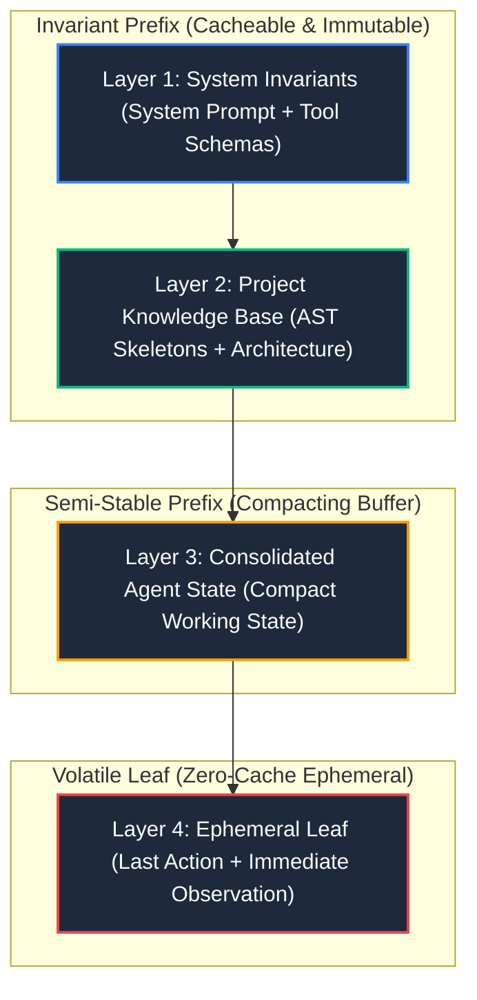

# 4-Layer Context Architecture (Gemini Context Caching)

This document defines the formal architecture and operational rules for maximizing context window efficiency through **Gemini Context Caching**, targeting a **Cache Hit Rate > 85%** and eliminating quadratic token compounding in long-running agent workflows.

---

## 1. Gemini Context Caching Fundamentals

Context caching in Gemini models (Google AI Studio and Vertex AI) operates via **strict deterministic exact prefix matching**.

### 1.1 Activation Thresholds
To trigger implicit or explicit prefix caching, prefix length must meet minimum thresholds:
- **Gemini Flash**: Minimum **2,048 tokens**.
- **Gemini Pro**: Minimum **4,096 tokens** (or 32,768 tokens for persistent TTL cached resources).
- Any prefix below the threshold is fully re-evaluated every turn at uncached rates.

### 1.2 The Prefix Invariance Invariant
> **Cascade Invalidation Principle**:
> If a single token, whitespace, dynamic timestamp, or nonce changes at position $N$, **all cached tokens from position $N$ onward are invalidated** for that turn.

To guarantee that 85%+ of context is served from warm cache, tokens are organized into 4 layers strictly sorted by volatility (least volatile to most volatile).

---

## 2. The 4-Layer Architecture

---

### Layer 1: System Invariants
- **Components**: Foundational system prompt, OpenAPI / tool schemas, security boundaries.
- **Volatility**: **0% (Immutable)** across the entire session.
- **Typical Size**: ~1,500 – 3,500 tokens.
- **Rule**: Absolute zero dynamic data. No timestamps, nonces, or dynamic dates.

### Layer 2: Project Knowledge Base
- **Components**: AST skeletons of critical interfaces (`agy_ast.py`), architecture constraints, dependency capsules.
- **Volatility**: **< 5% (Append-only)**. Updated only during major phase changes.
- **Typical Size**: ~2,500 – 12,000 tokens (surpasses the 2k/4k activation threshold combined with Layer 1).
- **Rule**: Pure code signatures and verified facts. No conversational turn history.

### Layer 3: Consolidated Agent State (Working State)
- **Components**: Compact handoff block (`HANDOFF COMPACT`). Objective, verified facts, touched files, discarded hypotheses, next action.
- **Volatility**: **Semi-stable**. Updated every 3 to 5 turns via structured replacement.
- **Typical Size**: ~400 – 1,200 tokens.
- **Rule**: Replaces the intermediate conversational trajectory, preventing $O(N^2)$ transcript growth.

### Layer 4: Ephemeral Leaf
- **Components**: The single most recent tool invocation and its sanitized observation output (from `noise_sanitizer.py` or `agy_pack.py`).
- **Volatility**: **100% (Changes every turn)**.
- **Typical Size**: ~300 – 1,500 tokens.
- **Rule**: Lives at the absolute tail of the prompt so its volatility never invalidates Layers 1, 2, or 3.

---

## 3. Mathematical Impact on Billing & Latency

Let $T_1, T_2, T_3, T_4$ be token counts for each layer, and $N$ be conversation turns:

- **Unoptimized Baseline**: Each turn resends full chat history:
  $$\text{Input Tokens}(N) = \sum_{i=1}^N (L_{\text{base}} + i \times L_{\text{turn}}) \approx O(N^2)$$
- **Layered Architecture with Context Caching**:
  - Warm Cache Input: $T_1 + T_2 + T_3$ (billed at ~10% cost, ~90% discount).
  - Uncached Input: $T_4$ (only the ephemeral leaf).
  - Effective Cost Factor:
    $$\text{Cost Factor} = 0.10 \times \frac{T_1 + T_2 + T_3}{T_{\text{total}}} + 1.0 \times \frac{T_4}{T_{\text{total}}} \approx 0.15 - 0.20$$
  - **Net Result**: 80% to 85% monetary cost reduction per interaction turn.
