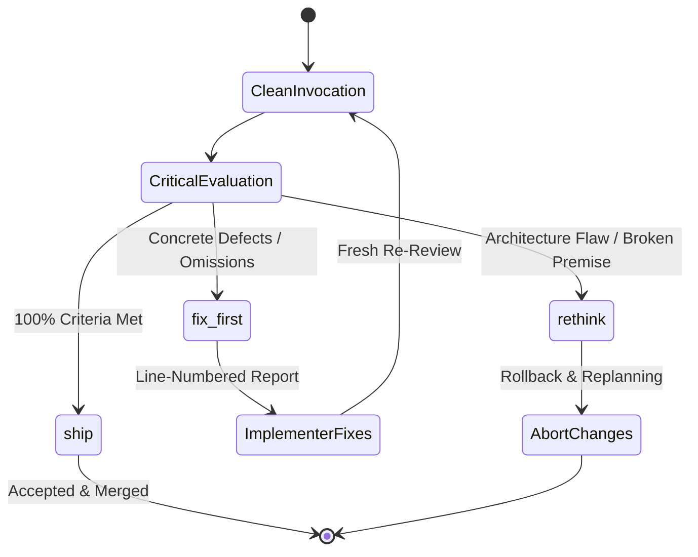

# Read-Only Reviewer Protocol (Gatekeeper Protocol)

This document establishes the formal audit and verification protocol using an isolated **Read-Only Gatekeeper**. Its purpose is to eliminate confirmation bias, decouple code quality assessment from accumulated conversation context, and ensure no changes are accepted without independent, reproducible verification.

---

## 1. Motivation & Bias Decoupling

In complex tasks, an implementer agent's context becomes contaminated with:
1. Failed prior attempts and internal rationalizations for shortcuts.
2. Context fatigue (loss of attention to edge cases in windows >50k tokens).
3. Self-fulfilling validation (assuming code is correct because the model remembers its intent rather than reading the diff objectively).

The **Gatekeeper Reviewer** is always invoked in a **clean, isolated context** (via a `research` or specialized read-only subagent).

---

## 2. Clean Context Invocation Requirements

The implementer must prepare a self-contained evidence packet free of conversational history.

### 2.1 Input Payload
The Reviewer's clean context must receive **only**:
- **Target Contract**: The functional specification of the task.
- **Canonical Git Diff**: Exact output of `git diff` or `git diff <base>...HEAD`.
- **Empirical Verification Evidence**:
  - Bounded test execution output (`scripts/agy_pack.py`).
  - Linter / type checker output (mypy, tsc, etc.).
- **Affected Signatures**: AST skeletons (`scripts/agy_ast.py`) of modified or consumed public interfaces.

### 2.2 Prohibitions
- **DO NOT** include the implementer's internal reasoning or conversational turns.
- **DO NOT** include subjective rationalizations for shortcuts.
- **DO NOT** transfer untouched files; supply only the diff and relevant AST skeletons.

---

## 3. Tri-State Verdict System

The Reviewer must evaluate the changes and issue **exactly one** of three formal verdicts:



### 3.1 Verdict: `ship`
- **Definition**: Final, unconditional acceptance. This is the **only** verdict authorizing task completion.
- **Mandatory Criteria**:
  - Clean, minimal diff directly satisfying requirements without dead code.
  - Automated tests pass completely.
  - Edge cases handled (nulls, bounds, concurrency).
  - No token leaks (unbounded logs, redundant calls).
  - Strict typing and repository convention compliance.

### 3.2 Verdict: `fix-first`
- **Definition**: Sound architecture, but concrete bugs, omissions, or unhandled edge cases remain.
- **Report Structure**:
  - Numbered list of findings with exact `file:line` locations.
  - Description of defect and missing regression test.
- **Follow-up Cycle**:
  - Implementer fixes findings in their workspace.
  - **Mandatory**: Triggers a **fresh re-review** in a clean context. The original reviewer does not approve on the fly.

### 3.3 Verdict: `rethink`
- **Definition**: Deep structural failure. The solution violates architecture, breaks public contracts, or assumes false premises.
- **Action**: Implementer discards changes (`git restore`) and restarts from planning.

---

## 4. Reviewer Hard Boundaries

| Rule | Description | Rationale |
| :--- | :--- | :--- |
| **No File Edits** | Reviewer is forbidden from calling `replace_file_content` or `write_to_file`. | Evaluates with critical detachment; does not become co-author. |
| **No Self-Corrections** | If a typo is found, report under `fix-first`. Do not fix it directly. | Preserves auditor neutrality and ensures changes pass through the test suite. |
| **Read-Only Verification** | May inspect test outputs, but never runs stateful destructive commands. | Maintains environment hygiene and idempotency. |
| **Deterministic Consistency**| Given the same diff and test evidence, returns the identical verdict. | Consistent quality bar across the repository. |

---

## 5. Canonical Review Report Template

```markdown
# GATEKEEPER REVIEW REPORT

## 1. Metadata
- **Commit / Scope**: [Commit range or files evaluated]
- **Target Contract**: [Specification or issue verified]
- **Test Evidence**: [Executed tests and inspection results]

## 2. Assessment Matrix
- [x] Functional correctness vs specification
- [x] Edge case handling and bounds
- [x] Strict typing and interface contracts
- [x] Resource efficiency and token leak prevention
- [x] Test coverage and quality

## 3. Findings (If applicable)
1. **`src/auth/session.py:84`**: Token refresh unhandled when `X-Refresh` header is empty.
   - *Impact*: Uncaught `KeyError` instead of HTTP 401.
   - *Required Remediation*: Add explicit guard and test case in `tests/test_session.py`.

## 4. Final Verdict
**VERDICT: [ ship | fix-first | rethink ]**
- *Summary Justification*: [Concise 1-2 paragraph rationale]
```
