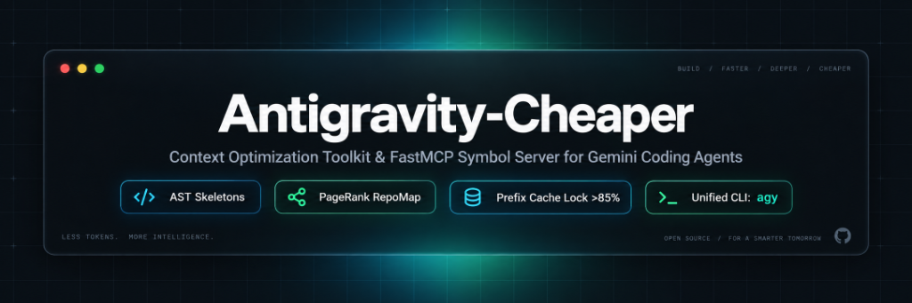
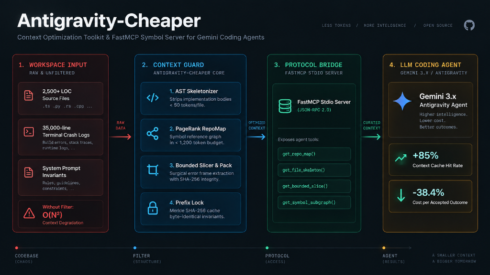

# Antigravity-Cheaper

<p align="center">
  
</p>

[](LICENSE)
[](https://www.python.org/)
[](https://github.com/9mirx0r/Antigravity-cheaper/actions)
[](https://github.com/9mirx0r/Antigravity-cheaper/releases)

Context optimization toolkit and FastMCP symbol server for **Google Antigravity** and **Gemini coding agents**.

In multi-turn coding sessions, agent context windows degrade rapidly. Unbounded file reading and massive terminal crash dumps cause quadratic token growth ($O(N^2)$), dilute model reasoning, and blow through API quotas.

**Antigravity-Cheaper** provides progressive disclosure tools, AST skeletonization, and prompt cache preservation to maintain high reasoning accuracy while reducing token overhead.

---

## Key Features

- **Unified Umbrella CLI (`agy`)**: Single executable giving access to all progressive disclosure subcommands (`agy map`, `agy skeleton`, `agy pack`, `agy memory`, `agy server`, `agy setup`, `agy cache`, `agy stats`).
- **FastMCP Auto-Setup Wizard (`agy setup`)**: Auto-detects and registers the symbol server in Antigravity, Cursor, and Claude Desktop configurations with dry-run support.
- **Gemini Context Caching Advisor (`agy cache`)**: Calculates frozen prefix token volume against Gemini 2.5/3.x thresholds (2,048 tokens), verifying eligibility for the 90% prompt cache discount.
- **Real-Time Workspace Dashboard (`agy stats`)**: Visual terminal card tracking module coverage, SQLite memory records, Merkle roots, and ledger financials.
- **AST Skeletonizer (`agy_ast.py`)**: Multi-language parser for **Python, JavaScript, TypeScript, Go, and Rust**. Strips implementation bodies with `...`, exposing function signatures, types, structs, and traits in under 50 tokens per file.
- **PreToolUse Noise Sanitizer (`noise_sanitizer.py`)**: Intercepts commands and filters terminal output to enforce token discipline, wrapping verbose test runners to bounded logs with Never-Worse token guarantees.
- **Personalized PageRank RepoMap (`agy_repomap.py`)**: Builds an in-memory symbol reference graph respecting `.gitignore` rules and ranks definitions using PageRank, fitting the workspace structure into a strict token budget (default: 1,200 tokens).
- **FastMCP Symbol Server (`agy_mcp_server.py`)**: Lightweight stdio Model Context Protocol (MCP) server with native UTF-8 and strict JSON-RPC 2.0 compliance, exposing surgical discovery tools (`get_repo_map`, `get_file_skeleton`, `get_bounded_slice`, `get_symbol_subgraph`).
- **Prompt Cache Prefix Locking (`agy_prefix_lock.py`)**: Merkle SHA-256 validation of system instructions, project files, and persistent memories to maximize Gemini Context Caching (>85% cache hit rate).
- **Bounded Error Slicing (`agy_pack.py`)**: Intercepts verbose test logs and compiler outputs, extracting only the relevant failure frames and context lines with SHA-256 integrity validation, suppressing 90%+ of terminal noise.
- **Auditable Telemetry Ledger (`agy_ledger.py`)**: Transparent JSONL ledger recording exact token usage, cache hits, wall-clock time, and cost per accepted outcome across Gemini 2.5 and 3.x models.

---

## Architecture

<p align="center">
  
</p>

The toolkit introduces a progressive disclosure filter between the local workspace and the agent's context window:

1. **Level 0 (Workspace Map)**: The agent inspects `get_repo_map` to understand project hierarchy without loading file bodies.
2. **Level 1 (AST Skeletons)**: When a module is needed, `get_file_skeleton` supplies interface definitions.
3. **Level 2 (Bounded Slices)**: Targeted edits use `get_bounded_slice` around exact line ranges identified via `grep_search`.
4. **Level 3 (Prefix Invariants)**: System prompts and static guidelines are locked as a frozen prefix to trigger Gemini's 90% cached token discount.

---

## Quickstart

### 1. Installation

```bash
git clone https://github.com/9mirx0r/Antigravity-cheaper.git
cd Antigravity-cheaper
pip install -e ".[dev,mcp]"
```

### 2. Configure Antigravity MCP
 
Run the auto-setup wizard to register `agy-symbol-server` automatically:

```bash
agy setup
```

*(Or configure manually in your MCP settings file):*

```json
{
  "mcpServers": {
    "agy-symbol-server": {
      "command": "python",
      "args": ["-m", "antigravity_cheaper.agy_mcp_server"]
    }
  }
}
```

### 3. Unified CLI (`agy`)

All progressive disclosure and diagnostic utilities can be executed directly via the unified `agy` command:

```bash
# Auto-configure FastMCP symbol server across detected MCP hosts
agy setup

# Verify Gemini 90% context caching eligibility and token volume
agy cache --root .

# Display unified workspace, memory, and telemetry dashboard
agy stats

# Generate a PageRank symbol map fitted to 1,000 tokens (respects .gitignore)
agy map --root . --budget 1000

# Extract AST skeleton of a specific file (signatures preserved, bodies elided)
agy skeleton --source src/antigravity_cheaper/agy_repomap.py

# Intercept and pack noisy logs to extract exact failure frames with SHA-256
agy pack --file failure.log --contains "AssertionError" --context 5

# Sanitize test runner command lines to enforce bounded execution
agy sanitize --cmd "pytest tests/"

# Lock and verify Merkle prefix invariants for Gemini prompt caching (>85% hit rate)
agy lock --root . --verify

# Query persistent memory repository statistics
agy memory stats

# Run FastMCP server self-test
agy server --test

# Query the telemetry ledger summary
agy ledger summary --ledger benchmarks/data/benchmark_usage.jsonl
```

---

## Repository Layout

```text
├── src/antigravity_cheaper/      # Canonical package implementation & unified agy CLI
│   ├── agy_setup.py              # 1-click MCP auto-configuration wizard
│   ├── agy_cache_advisor.py      # Gemini 90% context caching eligibility calculator
│   ├── agy_stats.py              # Real-time workspace health & telemetry dashboard
│   ├── agy_ast.py                # Multi-language AST skeletonizer (Python, JS, TS, Go, Rust)
│   ├── noise_sanitizer.py        # PreToolUse command sanitizer & Never-Worse filter
│   ├── agy_repomap.py            # Personalized PageRank symbol dependency graph
│   ├── agy_mcp_server.py         # FastMCP stdio server (JSON-RPC 2.0)
│   ├── agy_prefix_lock.py        # Merkle tree prefix lock (>85% cache hit rate)
│   ├── agy_pack.py               # Bounded error slicer & log noise suppressor
│   ├── agy_handoff.py            # Local threshold router & circuit breaker
│   ├── agy_ledger.py             # Telemetry recording & cost accountant
│   ├── agy_memory.py             # SQLite + FTS5 persistent memory
│   └── cli.py                    # Unified 'agy' umbrella CLI
├── .agents/                      # Agent configurations & backward-compatible shims
├── benchmarks/                   # Real-world telemetry benchmarks (Blackbox, Triathlon)
└── tests/                        # 69 unit tests passing across Python 3.10-3.14
```

---

## Empirical Benchmarks

Evaluated head-to-head on identical tasks using **Gemini 3.8 Flash (High Reasoning Effort)**. All runs were tracked in the telemetry ledger with 100% test pass verification:

| Task / Workload | Baseline Tokens | Cheaper Tokens | Token Delta | Baseline Thinking | Cheaper Thinking | Thinking Delta | Baseline Cost | Cheaper Cost | Cost Delta |
|---|---|---|---|---|---|---|---|---|---|
| **Operation Blackbox**<br>(2,500 LOC engine, 8 bugs, 20 tests) | 2,376,969 | 2,315,265 | **-2.6%** | 8,300 | 6,871 | **-17.2%** | $0.3626 | $0.3523 | **-2.9%** |
| **Systems Engineering Triathlon**<br>(SQLite B-Tree + Raft 2PC + BitTorrent) | 155,960 | 185,050 | +18.6% | 9,179 | 6,402 | **-30.3%** | $0.0943 | $0.0384 | **-59.3%** |
| **Hextech Oracle App**<br>(LoL companion, SQLite WAL, Tkinter) | 930,745 | 628,593 | **-32.5%** | 8,097 | 5,125 | **-36.7%** | $0.0775 | $0.0576 | **-25.7%** |

### Macro Portfolio Summary (10 Evaluated Tasks)

Aggregated from [benchmarks/data/benchmark_usage.jsonl](benchmarks/data/benchmark_usage.jsonl):

- **Gemini Context Cache Hit Rate**: **85.0%** (vs 83.4% baseline).
- **Reasoning Tokens**: **-17% to -36%** reduction in internal thinking tokens due to clean attention window.
- **Cost per Accepted Task**: **$0.0508** (token_guard) vs **$0.0825** (baseline) — **38.4% net cost reduction** across diverse domains.

To reproduce the benchmark evaluations locally:

```bash
# Run Operation Blackbox evaluation
python benchmarks/blackbox_benchmark/test_runners/test_blackbox.py

# Run Systems Triathlon evaluation
python benchmarks/triathlon_benchmark/run_triathlon_evaluator.py
```

---

## Running Unit Tests

Run the complete test suite (69 passing tests):

```bash
python tests/test_suite.py
```

---

## License

MIT License. See [LICENSE](LICENSE) for details.
